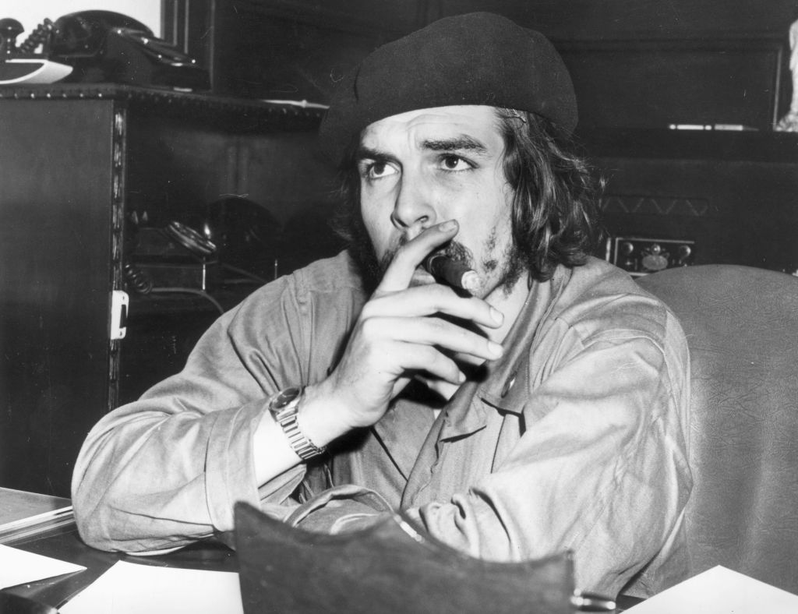

# Praktikum-SistemKeamanan

## CHE GUEVARA

- Ernesto "Che" Guevara (14 Juni 1928-9 Oktober 1967) adalah seorang pejuang revolusi, dokter, penulis, pemimpin gerilyawan, diplomat, dan pakar teori militer asal Argentina yang berhaluan Marxis. Sebagai salah satu tokoh utama dalam Revolusi Kuba, wajahnya telah menjadi simbol perlawanan dalam gerakan kontra-kebudayaan dan dalam budaya populer.

Saat masih menjadi seorang mahasiswa kedokteran, Guevara menjelajahi wilayah Amerika Selatan dan mengalami radikalisasi akibat kemiskinan, kelaparan, dan penyakit yang ia saksikan dengan mata kepalanya sendiri. Ia sangat ingin menghentikan eksploitasi yang menurutnya dilakukan oleh "kapitalis Amerika Serikat", sehingga ia mencoba membantu reformasi sosial yang dicanangkan di Guatemala oleh Presiden Jacobo Árbenz. Namun, Árbenz kemudian dilengserkan dengan bantuan dari CIA atas desakan dari United Fruit Company, sehingga Guevara menjadi semakin mantap dengan ideologi yang dianutnya. Setelah itu, ia pindah ke Kota Meksiko, dan di situ ia bertemu dengan Raúl dan Fidel Castro dan bergabung dengan Gerakan 26 Juli. Mereka berlayar ke Kuba dengan menumpangi sebuah kapal yacht yang bernama Granma, dengan tujuan menjatuhkan diktator Kuba yang didukung oleh Amerika Serikat, Fulgencio Batista.Guevara kemudian menjadi tokoh yang terkenal di kalangan pemberontak dan diangkat sebagai komandan kedua, dan ia sendiri juga memainkan peranan yang penting dalam kampanye gerilya selama dua tahun yang pada akhirnya berhasil melengserkan rezim Batista.
Guevara juga merupakan seorang penulis. Ia menyusun sebuah buku panduan tentang perang gerilya dan juga sebuah memoar tentang perjalanan masa mudanya dengan menggunakan sepeda motor. Pengalamannya serta ideologi Marxisme–Leninisme yang ia anut membuatnya meyakini bahwa keterbelakangan dan kebergantungan negara-negara Dunia Ketiga merupakan dampak dari imperialisme, neokolonialisme, dan kapitalisme monopoli, dan ia berkeyakinan bahwa hal ini hanya dapat dirombak oleh internasionalisme proletarian dan revolusi dunia.Guevara meninggalkan Kuba pada tahun 1965 untuk mengobarkan revolusi di luar negeri. Pertama-tama ia mencoba membantu pemberontak di Kongo-Kinshasa, tetapi upaya ini mengalami kegagalan. Ia lalu menjadi gerilyawan di Bolivia, tetapi ia ditangkap oleh militer Bolivia yang dibantu CIA dan kemudian dihukum mati dengan ditembak.

